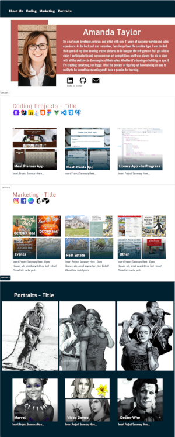

# Portfolio Site

[](https://shields.io/)  - [Amanda Taylor: Portfolio](https://amandataylor-portfolio.netlify.app "My finished site")

My goal is to create a portfolio website that highlights not only the all of the coding projects that I've worked on, but the marketing that I've worked on and the numerous portraits that I've created. I really want to highlight that I'm a software developer that also has an eye for design. 

 

## Project setup
```
npm install
```

### Compiles and hot-reloads for development
```
npm run serve
```

### Compiles and minifies for production
```
npm run build
```

### Lints and fixes files
```
npm run lint
```

### Customize configuration
See [Configuration Reference](https://cli.vuejs.org/config/).
